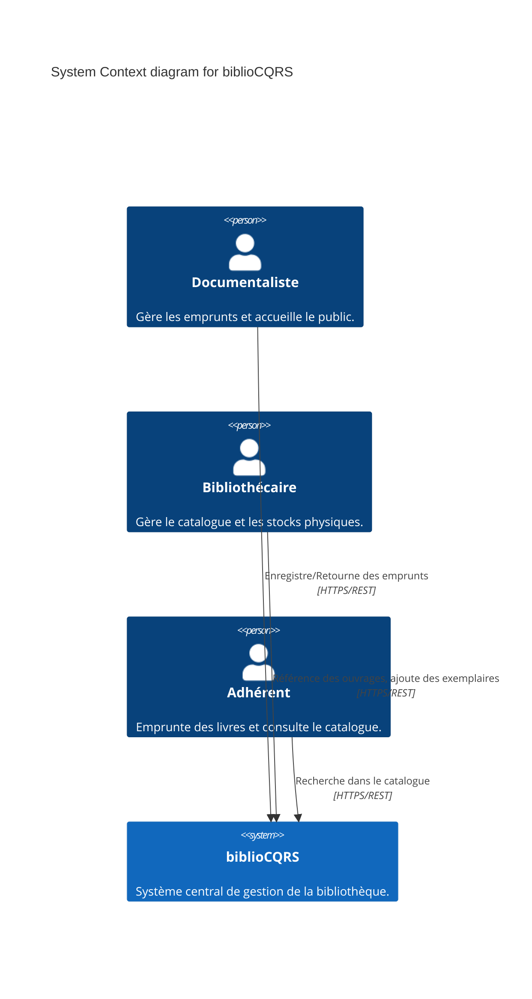
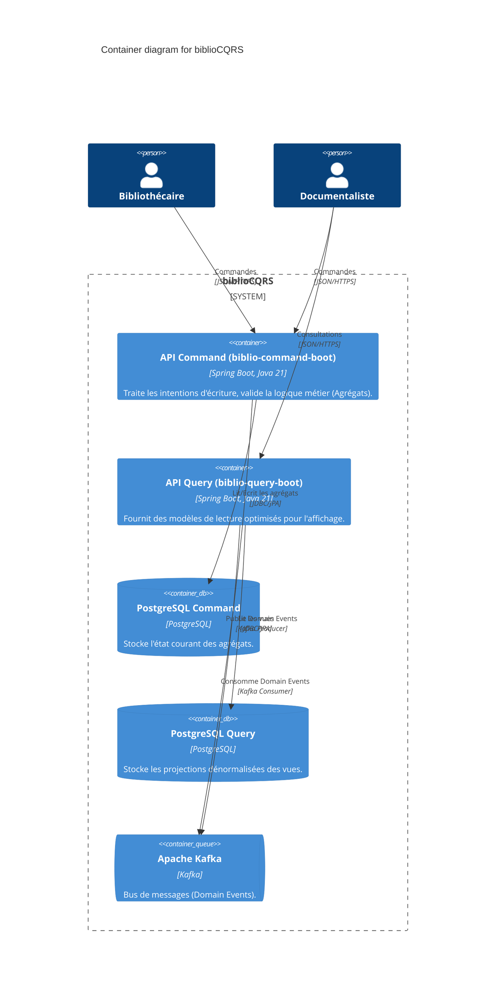
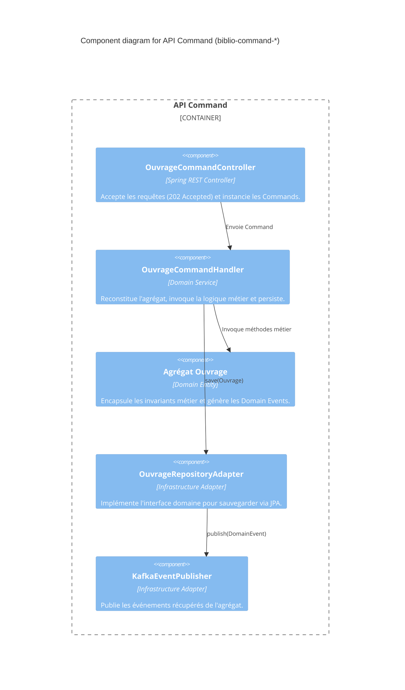

# C4 Model : biblioCQRS

Ce document utilise la notation C4 pour décrire l'architecture logicielle du système, rendue avec Mermaid.

## Niveau 1 : System Context

## Niveau 2 : Container

## Niveau 3 : Component (API Command - Zoom sur le Domaine Ouvrage)

