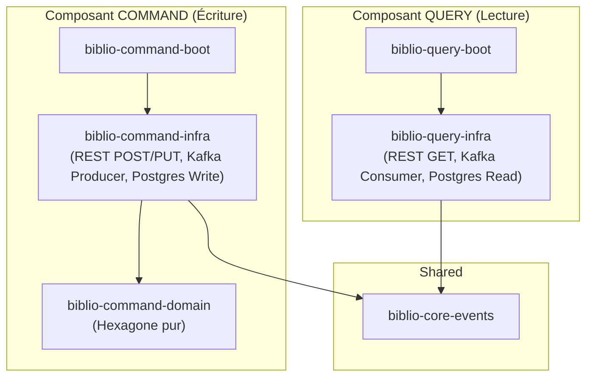

# Documentation d'Architecture - BiblioCQRS

## 1. Style Architectural Global
Le système repose sur la combinaison de trois grands principes architecturaux :
1.  **Architecture Hexagonale (Ports et Adaptateurs)** : Isolement strict du cœur de métier (Domaine) de toute adhérence technologique (frameworks, bases de données, bus de messages).
2.  **CQRS (Command Query Responsibility Segregation)** : Séparation physique et logique entre les modèles d'écriture (Commandes) et de lecture (Requêtes).
3.  **Event-Driven Architecture (EDA)** : Communication asynchrone entre le composant Command et le composant Query via des événements de domaine distribués.

## 2. Découpage en Modules (Maven)

## 3. Infrastructure & Déploiement
*   **Base de Données** : PostgreSQL (Schémas distincts pour Write Model et Read Model).
*   **Message Broker** : Apache Kafka (Utilisé pour transporter les Domain Events du Command vers le Query de manière asynchrone et résiliente).
*   **Conteneurisation** : Déploiement local orchestré via Docker Compose.
