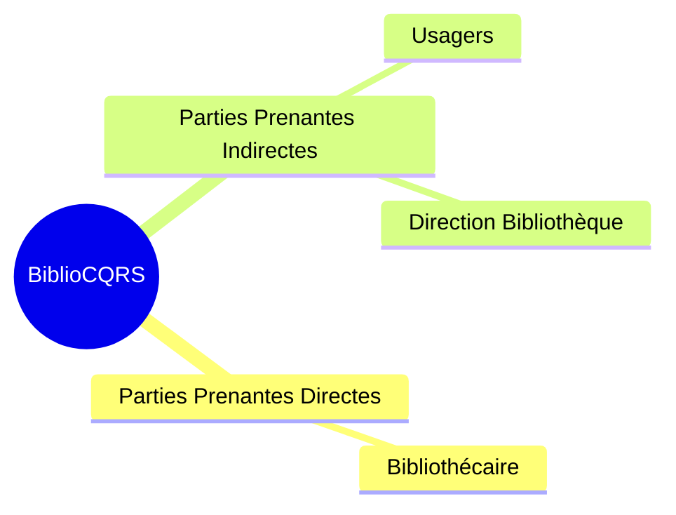
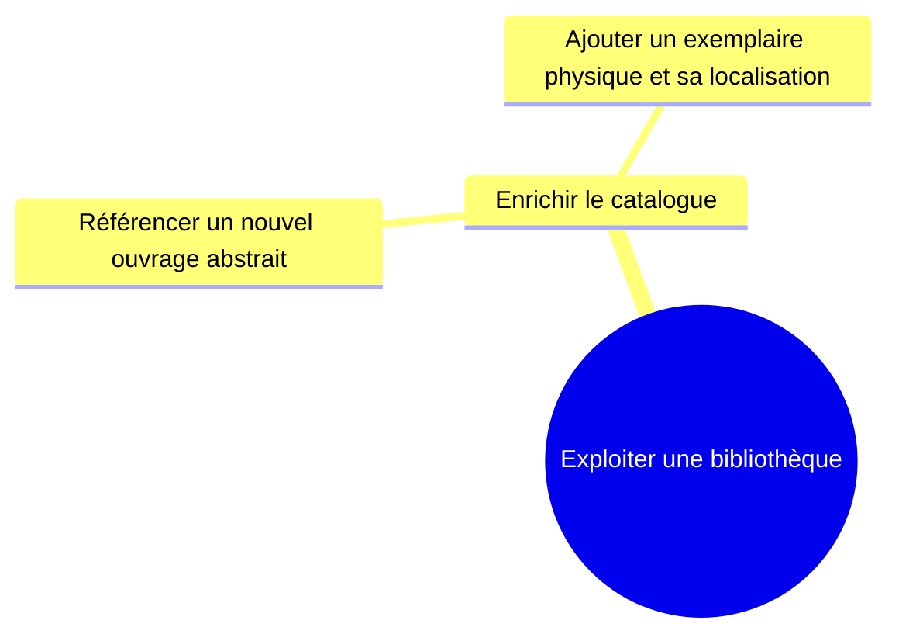
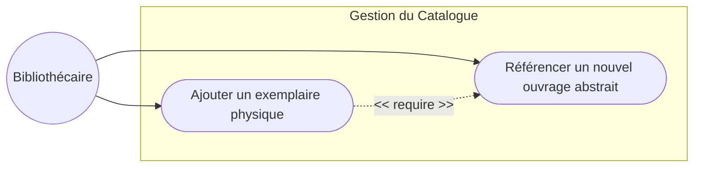

# Documentation Fonctionnelle - BiblioCQRS

## 1. Vision du Produit
**Le système BiblioCQRS** est une **plateforme de gestion de catalogue** qui sert aux **bibliothèques** à **référencer et localiser avec précision** leurs ressources physiques. Il apporte **une séparation stricte entre la gestion des règles métier (Command) et l'affichage des données (Query)**, garantissant une grande évolutivité, de la performance en lecture et une traçabilité des événements.

## 2. Carte des Parties Prenantes

*(À l'heure actuelle, seul le Bibliothécaire interagit avec le système).*

## 3. Arbre des Objectifs
Cette décomposition relie notre objectif métier de haut niveau aux cas d'utilisation opérationnels actuels.

## 4. Modèle du Domaine (Glossaire)
*   **Ouvrage (Work/Book)** : Une référence abstraite de livre, caractérisée par son ISBN (identifiant unique global), son titre, et son auteur.
*   **Exemplaire (Copy/Item)** : L'entité physique concrète.
*   **Lieu de Stockage (Location)** : La localisation physique (Salle, Étagère, Position).

## 5. Cas d'Utilisation Opérationnels (Use Cases)

### 5.1. Fonctionnalité : Référencement d'un ouvrage
L'objectif central est d'enrichir le catalogue par une nouvelle référence. 
*   Le système permet de déclarer un ouvrage de façon abstraite (ISBN, Titre, Auteur).
*   Le système garantit l'unicité stricte des ouvrages référencés (impossible d'avoir des doublons d'ISBN).
*(Les règles de gestion exactes sont documentées de manière exécutable dans nos tests BDD `reference_ouvrage.feature`).*
