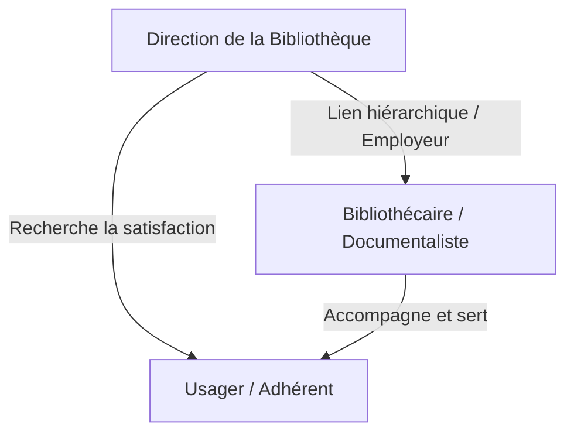
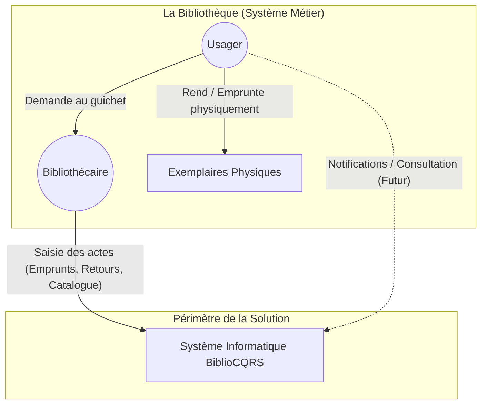

# 1. Vision et Contexte

## 1.1 Vision du Produit

**Le système informatique BiblioCQRS** est une **plateforme de gestion de catalogue et de prêt** qui sert aux *
*bibliothèques** à **référencer, localiser avec précision et prêter** leurs ressources physiques. Il apporte **une
séparation stricte entre la gestion des règles métier (Command) et l'affichage des données (Query)**, garantissant une
grande évolutivité, de la performance en lecture et une traçabilité des événements.

## 1.2 Cartographie des Parties Prenantes

### 1.2.1 Diagramme des Relations

### 1.2.2 Matrice des Attentes, Risques et ROI

| Partie Prenante            | Attentes vis-à-vis du système                                    | Risques                                                                      | ROI / Valeur ajoutée                                                       |
|----------------------------|------------------------------------------------------------------|------------------------------------------------------------------------------|----------------------------------------------------------------------------|
| **Direction Bibliothèque** | Statistiques fiables, respect du règlement, satisfaction usager. | Perte financière (livres volés), mécontentement des usagers.                 | Optimisation du budget d'achat, pilotage basé sur la donnée (CQRS Query).  |
| **Bibliothécaire**         | Outil rapide, fiable, évitant les erreurs de saisie.             | Complexité de l'outil, perte de temps au guichet, conflits avec les usagers. | Gain de temps sur la gestion des prêts, diminution du stress opérationnel. |
| **Adhérent (Usager)**      | Emprunter rapidement, catalogue clair, règles transparentes.     | Oubli des dates de retour, blocage injustifié du compte.                     | Expérience fluide, accès garanti aux ressources culturelles.               |

## 1.3 Diagramme de Contexte du Système

Il est crucial de distinguer la Bibliothèque (Système Métier / Réalité physique) du Système de Gestion informatisé (
BiblioCQRS). Notre périmètre d'étude est uniquement **BiblioCQRS**.

*(Le système informatique n'interagit pas directement avec les livres, il est alimenté par les actions du Bibliothécaire
qui sert d'interface de saisie pour la réalité physique).*
