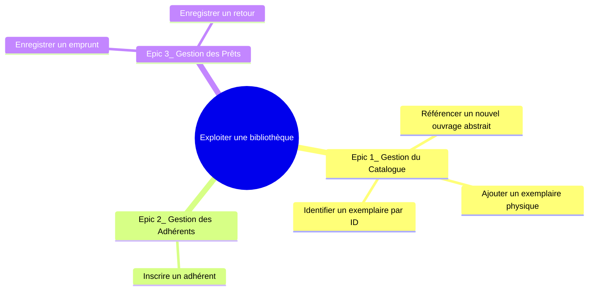
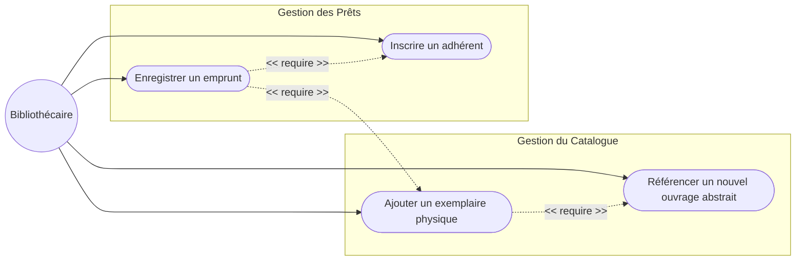

# 3. Scénarios et Règles de Gestion

## 3.1 Arbre des Objectifs

Cette décomposition relie notre objectif métier de haut niveau aux cas d'utilisation opérationnels actuels.

## 3.2 Cas d'Utilisation Opérationnels (Use Cases)

## 3.3 Scénarios : Référencement de livre

**Scénario Nominal :**
Le documentaliste souhaite enrichir le catalogue.

1. Il déclare un ouvrage de façon abstraite (ISBN, Titre, Auteur).
2. Le système garantit l'unicité stricte des ouvrages référencés.
3. Il ajoute ensuite un exemplaire physique rattaché à cet ouvrage.

## 3.4 Scénarios : Emprunt d'un exemplaire

**Scénario Nominal :**
L'usager a un livre dans les mains et souhaite l'emprunter. Il est adhérent.

1. Le documentaliste enregistre l'emprunt dans le système (fournit l'ID de l'exemplaire et l'ID de l'adhérent).
2. Le système vérifie les règles : l'adhérent a moins de 5 emprunts en cours, et au maximum 1 seul retard.
3. Le système enregistre l'emprunt, fixe la date de retour max à +3 semaines et en informe le documentaliste.
4. Le documentaliste informe l'usager de sa date de retour maximale.

**Scénarios d'Exception (Règles Métier) :**

* **Quota atteint :** Si l'adhérent a déjà 5 emprunts actifs, le système refuse l'emprunt.
* **Trop de retards :** Si l'adhérent a strictement plus de 1 livre en retard (2 ou plus), le système refuse l'emprunt.
